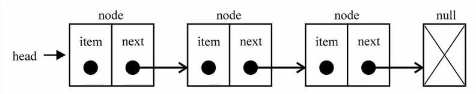

# 认识链表

链表和数组一样，可用于存储`一系列的元素`，但链表和数组的`实现机制完全不同`。双方也各有千秋，下面就让我们来对比一下。

### 数组

​	要存储多个元素，数组（或称为列表）可能是我们最常用的线性数据结构。因为几乎每一种编程语言都有默认实现的数组结构。

**优点**

* 查询数据较为方便，直接通过`索引`即可锁定目标元素。

**缺点**

在`操作数据`、`占用内存`方面，性能不是很好。

* 数组的创建通常需要申请一段**连续的**内存空间，并且**大小是固定的**，若数组后期不能满足容量需求时，就需要**扩容**（申请一个容量更大的数组，将原数组中的数据copy到新数组中）
* 在数组的`开头`、`中间`位置进行数据`增加`、`删除`操作，性能不高，需要进行大量元素的位移。
* 虽然JavaScript的Array类中的方法可以帮我们做这些事，但背后的原理是相同的。

### 链表

​	要存储多个元素，另外一个选择就是`链表`了，链表的实现原理与Array不同，并且也有自身的优缺点（恰好与Array相反）。

链表中的每一个元素，由两部分组成：

1. 存储元素本身的节点
2. 指向下一个元素的引用（指针）

我们可以把链表结构形象的看作一个火车：

* 车头：链表的头部`head`，head指针指向第一个元素。
* 车厢：之后的各个元素`item`





**优点**

在`操作数据`、`占用内存`方面，性能较好。

* 链表在创建时，内存空间不是连续的，可以充分利用计算机的内存，实现灵活的`内存动态管理`
* 链表的大小也是不定的，较为灵活，我们可以随时在原基础上进行扩张，理论上链表的大小是可以无限扩张的。
* 链表在`增加`、`删除`数据时，性能较好时间复杂度可达O(1)。

**缺点**

* 查询数据性能不如Array，只能通过**指针**，从头到尾依次查找。

# 链表的封装

​	通过上文，我们已经对链表结构有了初步的认知，现在让我们来手动封装一下链表。

### 结构的封装

​	首先我们要搭建出链表的基本结构，即`头部、各个元素`，先将二者定义在`LinkedList`类内部。

​	我们还可以定义一个`length`属性，记录链表的长度，便于后期利用

```
function LinkedList() {
  //头部指针
  this.head = null;
  //记录长度
  this.length = 0;
}
//各个节点类
function Node(data) {
  this.data = data;
  this.next = null;
}
```

### 常用方法的封装

在封装前，我们先来认识一下，链表中有哪些`常见的方法`：

1. 增

   | Name                 | description            |
   | -------------------- | ---------------------- |
   | append(ele)          | 在链表尾部追加一个元素 |
   | insert(position,ele) | 在指定位置插入一个元素 |

2. 删

   | Name               | description        |
   | ------------------ | ------------------ |
   | remove(ele)        | 移除某个元素       |
   | removeAt(position) | 移除特定位置的元素 |

3. 改

   | Name                    | description        |
   | ----------------------- | ------------------ |
   | update(position,newEle) | 修改某个位置的元素 |

4. 查

   | Name          | description        |
   | ------------- | ------------------ |
   | get(position) | 移除某个元素       |
   | indexOf(ele)  | 移除特定位置的元素 |

5. 其它

   | Name       | description        |
   | ---------- | ------------------ |
   | size()     | 返回链表的元素个数 |
   | isEmpty()  | 是否为空表         |
   | toString() | 转化成字符串输出   |

#### append

`appent(ele)`实现过程：

* 实例化Node类，创建节点
* 若链表为空，将`head`指向该节点
* 否则，一直向后查找，直到next为null，找到末尾，进行插入

```
LinkedList.prototype.append = function (ele) {
  let newNode = new Node(ele);
  if (!this.head) {
    this.head = newNode;
  } else {
    let current = this.head;
    while (current.next) {
      current = current.next;
    }
    current.next = newNode;
  }
  this.length++;
  return this.size();
};
```

#### insert

`insert(position,ele)`实现过程：

* 边界处理

* 实例化Node类，创建节点
* 两种情况
  * 在开头插入
  * 在之后插入

```
LinkedList.prototype.insert = function (position, ele) {
  if (position < 0 || position > this.length) {
    return false;
  }
  let newNode = new Node(ele);
  if (position === 0) {
    newNode.next = this.head;
    this.head = newNode;
  } else {
    let index = 0;
    let current = this.head;
    let previous = null;
    while (index++ < position) {
      previous = current;
      current = current.next;
    }
    newNode.next = previous.next;
    previous.next = newNode;
  }
  this.length++;
  return this.size();
};
```

#### removeAt

`removeAt(position)`实现过程：

* 边界处理
* 根据位置，查找对应的`previous`、`current`、`next`信息
* 删除操作
  * 删除起始位置数据
    * 长度是否为1
  * 删除之后位置数据

```
LinkedList.prototype.removeAt = function (position) {
	//边界处理
  if (position < 0 || position >= this.length) {
    return false;
  }
  //根据位置，查找对应的 previous、current、next 信息
  let current = this.head;
  let previous = null;
  let next = null;
  let index = 0;
  while (index < position) {
    previous = current;
    current = current.next;
    next = current.next;
    index++;
  }
  //删除起始位置数据
  if (index === 0) {
  	//长度是否为1
    if (this.length === 1) {
      this.head = null;
    } else {
      next = this.head.next;
      this.head.next = null;
      this.head = next;
    }
    //删除之后位置数据
  } else {
    current.next = null;
    previous.next = next;
  }
  return current.data;
};
```

#### remove

`remove(ele)` 与 `removeAt(position)` 的实现过程非常类似，只不过现在需要根据ele寻找对应位置的元素。

独立实现：

```
LinkedList.prototype.remove = function (ele) {
  let current = this.head;
  let previous = null;
  let next = null;
  let index = 0;
  while (current && current.data != ele) {
    previous = current;
    current = current.next;
    next = current.next;
    index++;
  }
  /*
  	这里!current有两种含义:
  	1. 未经过上文的while循环，this.head为空，即空表
  	2. 经过while，但是到链表的末尾还是未找到对应ele
  */
  if (!current) {
    return false;
  } else {
    if (index === 0) {
      if (this.length === 1) {
        this.head = null;
      } else {
        next = this.head.next;
        this.head.next = null;
        this.head = next;
      }
    } else {
      current.next = null;
      previous.next = next;
    }
    return current.data;
  }
};
```

后期根据其他方法进行实现：

* `indexOf`查找对应元素的索引
* `removeAt`根据索引进行删除

```
LinkedList.prototype.remove = function (ele) {
  let index = this.indexOf(ele);
  return index === -1 ? false : this.removeAt(index);
};
```

#### update

`update(position,newEle)`实现过程：

* 边界处理
* 根据`position`查找目标元素
* 将`newEle`赋予给目标元素的数据部分

```
LinkedList.prototype.update = function (position, newEle) {
  if (position < 0 || position >= this.length) {
    return false;
  }
  let current = this.head;
  let index = 0;
  while (index++ < position) {
    current = current.next;
  }
  current.data = newEle;
  return true;
};
```

#### get

`get(position)`实现过程与`update`几乎一样，最后一步只需将对应数据返回即可

细节：

* 这里的边界处理返回`null`，代表此时获取不到。
* `update`边界处理、整个函数返回为`boolean`，代表是否更新成功

```
LinkedList.prototype.get = function (position) {
  if (position < 0 || position >= this.length) {
    return null;
  }
  let current = this.head;
  let index = 0;
  while (index++ < position) {
    current = current.next;
  }
  return current.data;
};
```

#### indexOf

`indexOf(ele)`实现过程：

* 根据`ele`查找对应的元素，并用`index`记录当前的索引

```
LinkedList.prototype.indexOf = function (ele) {
  let current = this.head;
  let index = 0;
  while (current && current.data !== ele) {
    current = current.next;
    index++;
  }
  /* 这里 !current 有两种含义，同上文 remove 方法的实现*/
  if (!current) {
    return -1;
  } else {
    return index;
  }
};
```

#### size

```
LinkedList.prototype.size = function () {
  return this.length;
};
```

#### isEmpty

```
LinkedList.prototype.isEmpty = function () {
  return this.length === 0;
};
```

#### toString

```
LinkedList.prototype.toString = function () {
  let current = this.head;
  let result = "";
  while (current) {
    result += current.next ? `${current.data} ` : `${current.data}`;
    current = current.next;
  }
  return result;
};
```

