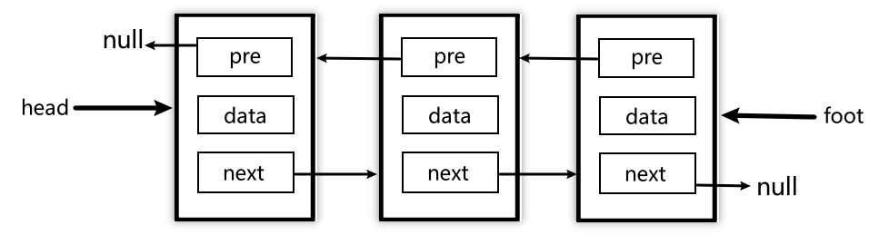

# 认识双向链表

### 单向链表的问题

​	在上一节中，我们不仅对链表有了一定的了解，还手动封装了链表及其常用方法。但之前我们接触到的实际上是`单向链表`，顾名思义：由于每个元素除了包含存储的数据之外，只包含一个指向下一个数据的引用，整个链表是单向的，我们在封装常用方法时就能体会到，涉及到查询某个元素，我们都要从`head`开始查找，很不方便。

​	在实际开发中，我们有很多操作都要获取目标节点的`前一个结点`，如果此时应用的是`单向链表`，我们就需要从头部重新查找，很消耗性能。因此我们可以使用**双向链表**。

### 双项链表结构

1. `head`头部
2. `item`各个元素
   * `pre`指向上一个引用
   * `data`数据部分
   * `next`指向下一个引用
3. `foot`尾部

# 双向链表的封装

