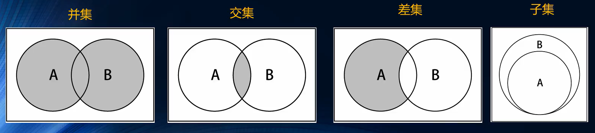

集合之间常见的操作如下：

* 并集：对于给定的两个集合，返回包含两个集合中所有元素的新集合
* 交集：对于给定的两个集合，返回包含两个集合中共有元素的新集合
* 差集：对于给定的两个集合，返回包含所有存在于第一个集合且不存在于第二个集合的元素的新集合。
* 子集：验证一个集合是否为另一个集合的子集



## 并集

* 遍历集合A，压入新集合
* 遍历集合B，压入新集合
  * 判断集合B中的元素是否存在A中，若不存在则压入。

>由于之前的add方法中已经进行了判断，因此直接遍历A、B集合，进行add即可。

```
Set.prototype.union = function (collection) {
  const result = new Set();
  for (let val of Object.values(this.items)) {
    result.add(val);
  }
  for (let val of Object.values(collection.items)) {
    result.add(val);
  }
  return result;
};
```

## 交集

* 遍历集合A，如果 item 也存在于集合B中，则压入新集合

```
Set.prototype.intersection = function (collection) {
  const result = new Set();
  const values = this.values();
  for (let i = 0; i < values.length; i++) {
    const item = values[i];
    collection.has(item) && result.add(item);
  }
  return result;
};
```

## 差集

* 遍历集合A，如果 item 不存在于集合B中，则压入新集合

```
Set.prototype.difference = function (collection) {
  const result = new Set();
  const values = this.values();
  for (let i = 0; i < values.length; i++) {
    const item = values[i];
    !collection.has(item) && result.add(item);
  }
  return result;
};
```


## 子集

判断集合A（调用者），是不是集合B（参数）的子集

思路一：

* 遍历集合B，如果 item 也存在于集合A中，则 counter++
* 最后返回 counter 是否等于集合A的长度即可。

```
Set.prototype.subset = function (collection) {
  let counter = 0;
  const values = collection.values();
  for (let i = 0; i < values.length; i++) {
    const item = values[i];
    this.has(item) && counter++;
  }
  return counter === this.values().length;
};
```

思路二：

* 遍历集合A，如果 item 不存在于集合B，则直接 return false
* 若遍历完毕，没有执行上述 return ，代表A的所有元素都在B中，直接 return true

```
Set.prototype.subset = function (collection) {
  const values = this.values();
  for (let i = 0; i < values.length; i++) {
    const item = values[i];
    if (!collection.has(item)) return false;
  }
  return true;
};
```

