# 基础知识


​	树，是一种非常形象的数据结构，因为它与现实生活中的树非常相似，并且在现实生活中，有很多关系都可以抽象为树结构，例如：公司的组织结构、家庭关系结构、电脑中的目录结构。

我们对照真实的树，就可总结出树结构的基本特点。

**节点**：

* 我们把树上的每个元素称为节点，若节点数目为0，则为空树。

**节点之间的关系**

* 上下节点称为`父子`结点，具有同一个父节点的左右节点互为`兄弟`节点
* 没有父节点的节点，称为`根节点`；没有子节点的节点，称为`叶子节点`

**概念**

* 节点的高度 = 节点到叶子节点的最长路径（边数）
* 节点的深度 =  根节点到目标节点的路径长度（边数）
* 节点的层 = 节点的深度 + 1
* 树的高度 = 根节点的高度

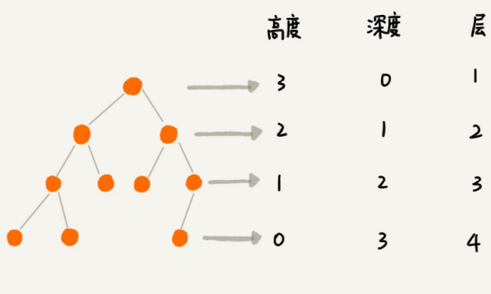

# 二叉树

树的结构多种多样，不过最常用的还是二叉树，下面就让我们来了解一下二叉树。

## 二叉树种类

二叉树的特点：、

* 每个节点 `最多` 有两个子节点，分别是左、右子节点。

不过，二叉树并`不要求`每个节点都必须有两个子节点。因此，又可以划分为：满二叉树、完全二叉树、非完全二叉树。

### 满二叉树

满二叉树，很好辨别，其特点为：

* 所有叶子节点都在最底层
* 除了叶子节点以外的节点，每个节点都有左右两个子节点。

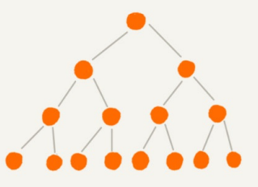

### 完全二叉树

* 叶子节点只出现在倒数一、二层
* 最后一层的叶子节点都向左靠拢

>也可理解为：在满二叉树的基础上去掉了右侧部分的叶子节点。

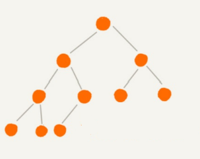

>此时你可能会有疑问：
>
>​	为什么完全二叉树定义: 最后一层的叶子节点都向左靠拢？而不是向右靠拢？后文[二叉树的表示/存储](##二叉树的表示/存储)会给予解答。

### 非完全二叉树

既不满足满二叉树、又不满足完全二叉树的情况，就是非完全二叉树。

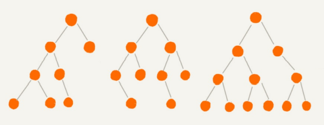

## 二叉树的表示/存储

要理解完全二叉树的定义，我们要先了解一下如何表示（存储）一棵二叉树。存储一颗二叉树一般有两种方法：

1. 基于数组的顺序存储（适用于`完全二叉树`）
2. 基于指针的链表存储（最常用的存储形式）

### 使用数组

按照 从上至下、从左往右 的顺序进行存储：

* 我们把根节点存储在下标 i=1 的位置
* 左子节点存储在下标 2 * i=2 的位置，右⼦节点存储在 2*i + 1=3 的位置。
* 以此类推，B节点的左子节点存储在 2 * i = 2 * 2 =4 的位置，右⼦节点存储在 2*i + 1 = 2 * 2 + 1 = 5 的位置。

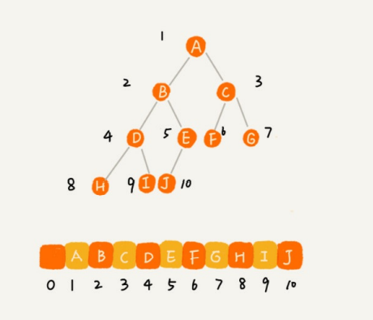

只要我们知道该节点的下标，就能够找到其父子节点，例如下标为 `i`：

* 父节点：Math.floor(i/2)
* 左子节点：i*2 ；右子节点：i * 2 +1

不过，刚刚举的例⼦是⼀棵`完全⼆叉树`，所以仅仅“浪费”了⼀个下标为0的存储位置。如果是`非完全⼆叉树`，就会浪费大量的存储空间👇。

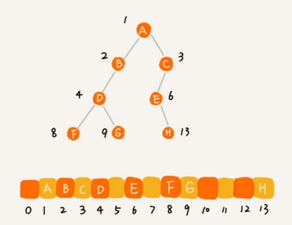

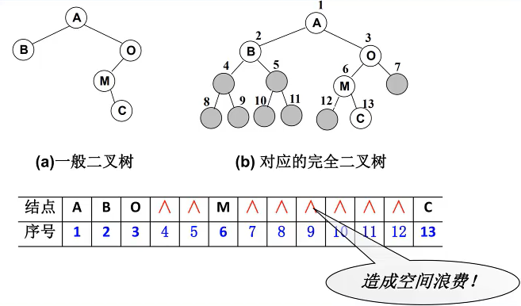

⭐

>⼀般情况下，为了⽅便计算，根节点会存储在下标为 `1` 的位置，实际存储可以从 `0` 开始，也就是说，完全二叉树使用数组存储，不会造成内存的浪费。
>
>并且完全二叉树使用数组存储，会更加节省内存，因为每个节点只需要包含数据部分，不需要存储左右子节点的引用，只需要根据下标即可推算出父子节点的位置。
>
>这也是为什么规定：完全二叉树最后一层的叶子节点都要向左靠拢的原因（需要从上至下，从左往右依次存储）

### 使用链表

链表是最常见的树结构存储方式，将每个节点封装成一个node，包含三部分：数据、左右子节点的引用。

```
{
	data,
	leftChild,
	rightChild
}
```

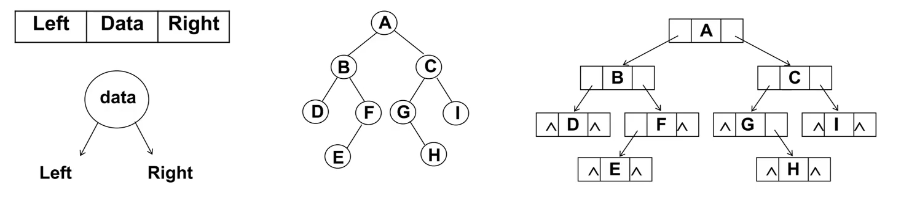

## 其它树转二叉树

二叉树神奇的地方在于：它可以模拟任何一种树；换言之：其他树都可转化为二叉树。

给定一棵树，如图所示：

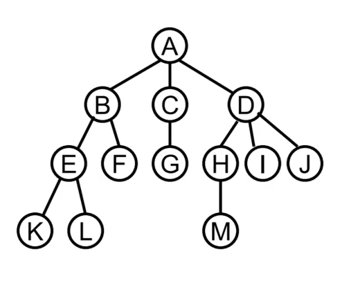

若将其用数据结构进行展示，最普通的表达方式为：

```
{
	data,	//本身数据
	childNodes:[]	//子节点的引用
}
```

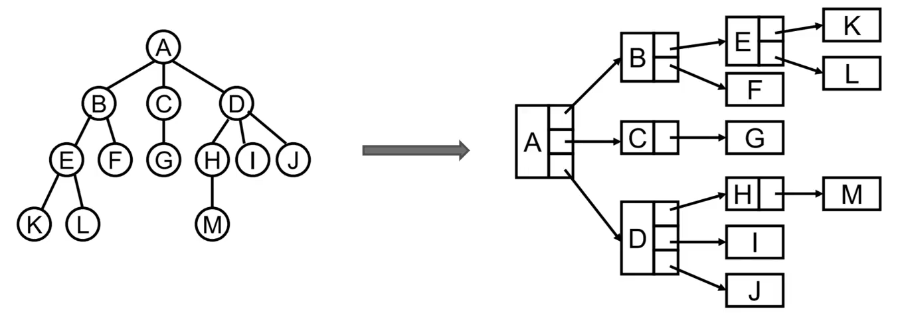

但如果我们将每个节点都用三个部分表示：

```
{
	data,
	leftChild,
	siblingNode,	//这些兄弟节点，充当了二叉树结构中的右子节点
}
```

就可转化为二叉树👇

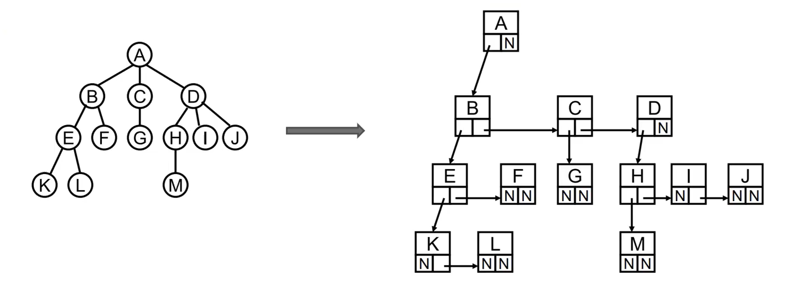

其实很好理解，每个节点除了自身的数据部分，都只包含两个元素，因此该方法也叫做 **左儿子右兄弟表示法** 。

将上图转化后的二叉树，顺时针旋转`45°`，结构会更加清晰：

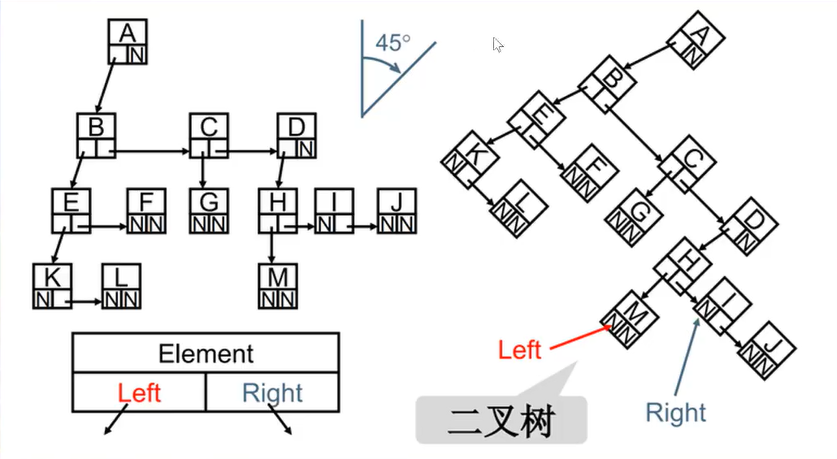

* 原来的左儿子充当的角色没有改变，转化后依旧是左儿子
* 原来的右兄弟节点 -> 右子节点
