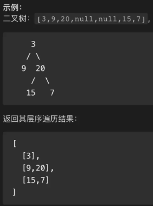
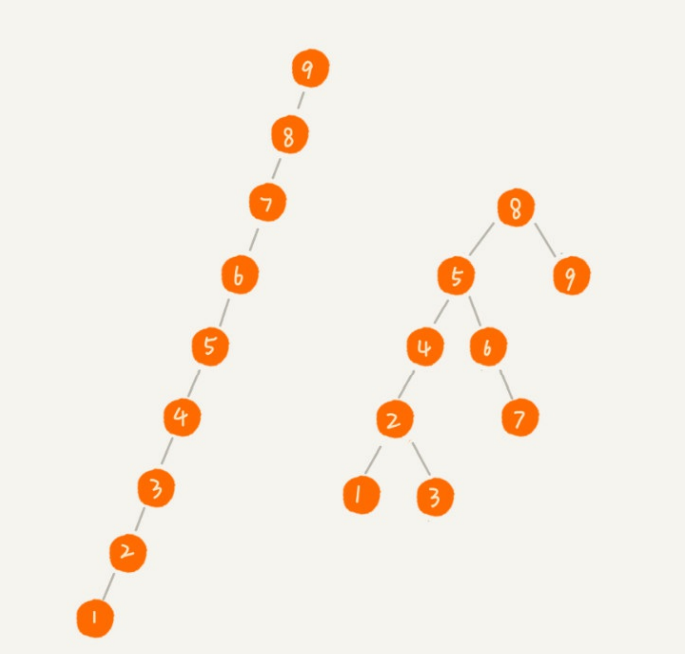

# 认识二叉搜索树

前面讲到，二叉树是常用的一种树结构，而 **二叉搜索树**(Binary Search Tree) 又是二叉树中常用的类型 。

它不仅支持快速的查找数据，还支持快速的插入、删除数据。能够具有这些优点，完全取决与二叉搜索树的`结构`：

* **寻找任一节点，都必须满足**：
  * 其左子树中的每个节点的 key ，都小于这个节点的 key
  * 其右子树中的每个节点的 key ，都大于这个节点的 key

下图列举三个例子，有助于理解：


# 概念补充

在之前的文章中，我们介绍了树的一些概念，例如：根节点、父子节点、兄弟节点、叶子节点。

这里再补充两个节点种类：`前驱节点` 与 `后继节点` ，这两个节点的概念对于后续手动封装（删除操作），起着重要的作用。

**前驱节点**：对一棵二叉树进行中序遍历，在遍历后的顺序中，当前节点的前一个节点为该节点的前驱节点

**后继节点**：对一棵二叉树进行中序遍历，在遍历后的顺序中，当前节点的后一个节点为该节点的后继节点

其实可以发现：

* 前驱节点就是：某节点左子树中最大的节点
* 后继节点就是：某节点右子树中最小的节点

并且，在 BST 中：前驱节点 或 后继节点 将某节点进行替换，依旧符合 BST 的结构。

例如：

* 将某节点(node)替换为该节点的前驱节点：
  * 由于前驱节点是该节点(node)左子树中最大的节点，该节点被替换后，依旧符合：左子树的所有节点都小于该节点，右子树中所有节点都大于该节点
* 同理，将某节点替换为该节点的后继节点后，也依旧符合 BST 的结构。


# 手动封装

这里不再封装修改操作，修改操作比较简单：找到指定节点，更新真正存放数据的属性即可。

为了更好的理解 BST 核心，这里没有考虑数据的存储。

## 基本结构

* 初始化根节点
* 封装Node类
  * key：节点的数值标识
  * left：左子节点
  * right：右子节点

>当然，我们还可以新增一个data属性，用于存储该节点的真实数据。（或其他属性）

```
function Node(key) {
  this.key = key;
  this.left = null;
  this.right = null;
}

export default function BinarySearchTree() {
  this.root = null;
}
```

## 插入操作

* 判断是否存在root，若不存在直接赋值给root，若存在：
* 不断递归查找合适位置
  * 比较 newNode.key 与 node.key ,决定是否从`左或右`子树查找
  * 若`左/右`节点不存在，直接赋值，若存在则继续递归查找。

```
//对外暴露方法
BinarySearchTree.prototype.insert = function (key) {
  const newNode = new Node(key);
  
  if (this.root === null) {
    this.root = newNode;
    return;
  }
  
  insertNode(this.root, newNode);
};
//内部使用，递归寻找合适位置
var insertNode = function (node, newNode) {
  if (newNode.key < node.key) {
    if (node.left === null) {
      node.left = newNode;
      return;
    } else {
      insertNode(node.left, newNode);
    }
  } else {
    if (node.right === null) {
      node.right = newNode;
      return;
    } else {
      insertNode(node.right, newNode);
    }
  }
};
```

测试代码：

```
import BST from "./BST.js";

const bst = new BST();
bst.insert(30);
bst.insert(15);
bst.insert(41);
bst.insert(33);
bst.insert(50);

console.log(bst);
```

## 遍历方式

### 先中后序

树的常见遍历方式有三种：`先序遍历`、`中序遍历`、`后序遍历`。所谓先中后，实际上说的是`根节点`的遍历顺序。

* 先序遍历：根节点->左子树->右子树
* 中序遍历：左子树->根节点->右子树
* 后序遍历：左子树->右子树->根节点

**实现思路**：

通过思考发现，这些遍历过程是不断重复的，因此使用递归实现再好不过了，

大佬说的好：递归代码的关键，就是看能不能写出递推公式，⽽写递推公式的关键就是，如果要解决问题A， 就假设⼦问题B、C已经解决，然后再来看如何利⽤B、C来解决A。

所以，我们可以把前、中、后 序遍历的递推公式都写出来：

* 先序遍历：preOrder(root) = console.log(root) ->  preOrder(root.left) -> preOrder(root.right)
* 中序遍历：midOrder(root) = midOrder(root.left) -> console(root )-> midOrder(root.right)
* 后序遍历：endOrder(root) = endOrder(root.left) -> endOrder(root.right)-> console.log(root)

既然得到了递推公式，代码实现就很简单了：

```
//先序遍历
BinarySearchTree.prototype.preOrder = function () {
  const result = [];
  order(this.root);
  return result;

  function order(root) {
    if (root === null) return;
    result.push(root.key);
    order(root.left);
    order(root.right);
  }
};
```

```
//中序遍历
BinarySearchTree.prototype.midOrder = function () {
  const result = [];
  order(this.root);
  return result;

  function order(root) {
    if (root === null) return;
    order(root.left);
    result.push(root.key);
    order(root.right);
  }
};
```

```
//后序遍历
BinarySearchTree.prototype.postOrder = function () {
  const result = [];
  order(this.root);
  return result;

  function order(root) {
    if (root === null) return;
    order(root.left);
    order(root.right);
    result.push(root.key);
  }
};
```

### 层序

层序遍历，就是按层级进行遍历：`从上至下，从左至右` 

难点：需要记录每个节点所在的层级。

示例：



实现思路：

* 使用队列，不断的出入队，处理每个节点，将该节点放入合适位置，直到遍历完整棵树。、
* 使用二维数组存储信息，第二维数组包含节点的 `key` 与 `层级` 。

```
//层序遍历
BinarySearchTree.prototype.layerOrder = function () {
  const queue = [[this.root, 0]];
  const result = [];

  while (queue.length) {
    const [node, level] = queue.shift();
    if (!result[level]) {
      result.push([node.key]);
    } else {
      result[level].push(node.key);
    }
    node.left && queue.push([node.left, level + 1]);
    node.right && queue.push([node.right, level + 1]);
  }

  return result;
};
```

## 查找操作

### findByKey

很好理解：不断递归对比，找到目标 `key` 所对应的节点。

```
BinarySearchTree.prototype.findByKey = function (key) {
  let node = this.root;
  while (node) {
    if (key > node.key) {
      if (!node.right) return null;
      node = node.right;
    }
    if (key < node.key) {
      if (!node.left) return null;
      node = node.left;
    }
    if (key === node.key) return node;
  }
  return node;
};
```

## 删除操作

二叉树的删除操作比较复杂，首先我们要找到目标节点，然后再考虑各种情况：

* 所删除节点为叶子节点
  * 直接让父节点对其引用置为 null
* 所删除节点有一个子节点
  * 将父节点对其引用置为该子节点
* 所删除节点有两个子节点
  * 将父节点对其引用置为：**右子树中最小的节点**。再删除这个最小节点。
  * 因为**右子树中的最小节点**替换掉旧节点后，依然满足：左子树所有节点都比它小，且右子树所有节点都比它大。
* 删除节点为根结点
  * 没有子节点：置根节点为`null`
  * 有一个子节点：置根节点为该子节点
  * 有两个子节点：置为右子树中最小的节点。再删除这个最小节点。

>​	对于所删除节点有两个子节点的情况，这里的思路是：替换为后继节点，再删除。同理，也可替换为前驱节点，再删除。

### 独立实现

```
BST.prototype.delete = function (key) {
  if (this.root === null) return false;

  let parent = null;
  let current = this.root;
  let isPointLeft = true;

  while (current && current.key !== key) {
    parent = current;
    if (key < current.key) {
      isPointLeft = true;
      current = current.left;
    } else if (key > current.key) {
      isPointLeft = false;
      current = current.right;
    }
  }
  
	//没有找到目标节点，或为空树
  if (current === null) return false;
	//找到节点，进行删除操作
  this.deleteNode(parent, current, isPointLeft);
};

BST.prototype.deleteNode = function (parent, current, isPointLeft) {
  const { left, right } = current;

  //叶子节点
  if (!left && !right) {
    //且为根节点
    if (current === this.root) {
      this.root = null;
      return;
    }
    parent[isPointLeft ? "left" : "right"] = null;
  }

  //有一个子节点
  else if (!left) {
    //且为根节点
    if (current === this.root) {
      this.root[isPointLeft ? "left" : "right"] = current.right;
      return;
    }
    parent[isPointLeft ? "left" : "right"] = current.right;
  } else if (!right) {
    //且为根节点
    if (current === this.root) {
      this.root[isPointLeft ? "left" : "right"] = current.left;
      return;
    }
    parent[isPointLeft ? "left" : "right"] = current.left;
  }

  //有两个子节点
  else {
  	//找到后继节点
    let successorP = parent;
    let successor = current.right;
    while (successor.left) {
      successorP = successor;
      successor = successor.left;
    }

    //删除节点为根节点
    if (current === this.root) {
      this.root.key = successor.key;
      this.deleteNode(successorP, successor, true);
      return;
    }

    //右节点没有左子树
    if (successor === current.right) {
      parent[isPointLeft ? "left" : "right"].key = current.right.key;
      this.deleteNode(current, current.right, false);
      return;
    }

    parent[isPointLeft ? "left" : "right"].key = successor.key;
    this.deleteNode(successorP, successor, true);
  }
};
```

### 方案二

```
BinarySearchTree.prototype.delete = function (key) {
  //定义一些变量，存储重要信息
  let parent = null;
  let current = this.root;
  let isPointLeft = false;

  while (current && current.key !== key) {
    parent = current;
    if (key > current.key) {
      isPointLeft = false;
      current = current.right;
    } else if (key < current.key) {
      isPointLeft = true;
      current = current.left;
    }
  }
  //最后没找到，或者为空树
  if (current === null) return false;
  
  const { left, right } = current;
  // 为叶子节点
  if (!left && !right) {
    if (parent === null) {
      //且为根节点
      this.root = null;
    } else {
      parent[isPointLeft ? "left" : "right"] = null;
    }
  }
  
  //有一个子节点
  else if (left === null) {
    if (parent === null) {
      //且为根节点
      this.root = current.right;
    } else {
      parent[isPointLeft ? "left" : "right"] = current.right;
    }
  }
  //
  else if (right === null) {
    if (parent === null) {
      //且为根节点
      this.root = current.left;
    } else {
      parent[isPointLeft ? "left" : "right"] = current.left;
    }
  }

  //有两个子节点
  else {
    const successor = this.getSuccessor(current);

    if (parent === null) {
      //且为根节点
      this.root = successor;
    } else {
      parent[isPointLeft ? "left" : "right"] = successor;
    }
    //更新左子树。更新右子树的操作，在getSuccessor中
    successor.left = current.left;
  }
};

/* 获取后继节点 */
BinarySearchTree.prototype.getSuccessor = function (delNode) {
  let parent = delNode;
  let current = delNode.right;

  while (current.left) {
    parent = current;
    current = current.left;
    console.log(current);
  }

  //这是最难理解的部分，实际上是合理删除后继节点，然后更新右子树。
  //若找到的节点不直接就是：删除节点的右子节点。代表该右节点存在左子树，上述while执行过。就需要合理删除后继节点
  if (current !== delNode.right) {
    parent.left = current.right;
    current.right = delNode.right;
  }
	//反之，若找到的节点直接就是：删除节点的右子节点。也代表该右子节点没有左子树，则直接return，让外部替换
  return current;
};
```

### 代码分析

方案一与方案二的区别主要在于 删除节点有两个子节点 这种情况的处理。

方案一做法：

* 将 key 进行替换，再调用一次delete方法删除后继节点

方案二做法：

* 直接操作指针，达到合理删除后继节点的目的

**优劣分析：**

方案一：

* 优点
  * 整个代码结构比较清晰，能够嵌套调用delete删除节点，省去了一些逻辑。
* 缺点
  * 如果每个节点还有其它的属性用于存放信息，在处理 删除节点有两个子节点 这种情况时，就不能只替换key，还要把除去left、right后的那些属性进行替换。
  * 但问题的解决也很简单：（遍历赋值即可）

方案二：

* 优点
  * 由于不存在单独替换某些属性这种情况，所有的操作都是通过指针完成的，因此弥补了方案一的缺点，更加严谨。
* 缺点：
  * 代码结构较为复杂，在处理 删除节点有两个子节点 这种情况时，代码逻辑不是连续的，例如：右子树的替换逻辑在`getSuccessor`中

### 结合版

**代码分析**

​	在方案二的基础上，结合方案一替换 key 的方式。值得注意的是：一定要先调用 delete 再替换 key 。如果顺序颠倒会导致死循环：

* 若 `被删除节点` 先替换了新的 key ，再调用 delete 时，又传入了该 key ，则又会进入相同的代码逻辑，以此往复，构成死循环。

**优点**

* 代码结构更加清晰。
* 方法的耦合度降低，`getSuccessor` 只负责获取后继节点，不掺杂其他操作。

```
BST.prototype.delete = function (key) {
  ……
  //有两个子节点
  else {
    const successor = this.getSuccessor(current);
    if (parent === null) {
      //且为根节点
      this.delete(successor.key);
      this.root[isPointLeft ? "left" : "right"].key = successor.key;
    } else {
      this.delete(successor.key);
      parent[isPointLeft ? "left" : "right"].key = successor.key;
    }
  }
};

//获取后继节点
BST.prototype.getSuccessor = function (delNode) {
  let parent = delNode;
  let current = delNode.right;

  while (current.left) {
    parent = current;
    current = current.left;
  }
  
  return current;
};
```


### 取巧方法

可以发现，关于 BST 的删除操作还是比较复杂的。

但其实有一种取巧的方法：

* 找到删除的目标节点，然后为其增加一个isDelete字段即可。
* 后续在其它方法中，只要根据节点的isDelete值，决定是否进行后续操作即可

但缺点也非常明显，当数据量足够大时，显然会造成大量的内存浪费。这是一种逃避的做法😂。


# 树的平衡性

​	开篇我们提到：BST 它不仅支持快速的查找数据，还支持快速的插入、删除数据。但在一些极端的状况下，BST 不再那么闪耀，这就涉及到了**树的平衡性**。

所谓平衡性，就是：左右子树节点分布的均衡程度。

* 如果左右子树节点分布比较均衡，树的平衡性就好，反之平衡性就差。

如果 BST 的平衡性差，则性能也会随之降低，让我们根据实例进行分析。



​	当我们不断插入数值连续的 `node` 时，就会出现左侧树的结构。你会发现此时所形成的 BST 已经与 `链表` 一模一样了，此时要查找一个 node ，与链表的查找操作无异，都是线性的依次查找。失去了 BST 的高效性。 

​	但如果我们通过一些操作，将这种很不平衡的 BST 转化为比较平衡的 BST 时（右侧树结构），就比较像我们之前所接触到的 BST 了。当然，我们还可以按照`某些复杂的规则`，将右侧树结构再次优化，让其不断地趋于平衡。

​	很显然，就是让其不断接近满二叉树，因为满二叉树就是最平衡的二叉树。

实现树结构优化的复杂规则，主要有两种：

* AVL树
  * AVL树是最早的一种平衡树，它有些方法保持树的平衡（每个 node 新增一个属性进行相关标记）
  * 但其 `插入` 和 `删除` 操作，相对于**红黑树**来说效率较低，所以现在通常使用红黑树。
* 红黑树
  * 在很多语言中（例如Java、C++）内部的一些数据结构都是用红黑树实现的。
  * 红黑树也非常复杂，后续文章会进行详细学习。

