# 认识红黑树

​	在之前学习 BST 时，讨论了树的平衡性，BST 平衡性越差，其性能也就越差。为了让 BST 更加趋于平衡（满二叉树），我们就可将其转化为 `红黑树` -RBT（Red Black Tree）。

首先要得知：**红黑树 是平衡版的 BST**。也就是说红黑树也完全符合 BST 的规则。但是除了这些基本的规则外，红黑树还新增了许多特性：

1. 根节点为黑色
2. 所有叶子节点都是黑色，且为空（NIL节点）
   * NIL即 `Nothing In Leaf` ，它是一种虚拟节点，出现于任何实际子节点不足2个的节点上
3. 每个红色节点的两个子节点都是黑色
   * 并且满足：上下两个节点不能同时为红色（从根节点到叶子节点的所有路径上，不能有两个连续的红色节点）
4. 从任意节点出发，到叶子节点的所有路径，都包含相同数目的黑色节点

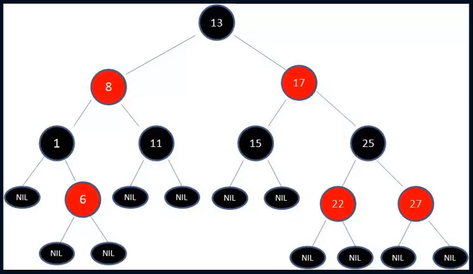

# 保持平衡

​	若想保持平衡，则要让 BST 符合红黑树的要求。但是，当我们操作该树时，可能会打破平衡的结构。我们需要针对不同的情况，使用不同的策略，保持树的平衡。

可以通过三种方式，让树保持平衡：`变色`、`左旋转`、`右旋转`。

## 变色

变色：为了重新符合红黑树的规则，尝试把红节点变为黑色，或者黑色变为红色。

### 默认颜色

值得注意的是：**在插入新节点时，默认为红色**

* 因为在插入节点为红色时，有可能不会破坏树的平衡(balance)
* 而插入黑色节点，必然会导致某条路径上`多了黑色节点`，而且这种情况很难进行调整

因为新插入节点的位置总是在 `某个叶子节点` ，其父节点非红即黑：

* 若父节点为红：则会导致连续出现红色节点，但这种情况比较好解决
* 若父节点为黑：必然导致某路径上多了黑色节点，且这种情况很复杂，不好解决。

### 实例分析

例如我们要插入一个 `key` 为 `14` 的新节点，默认颜色为红，在找到合适的插入位置后，进行插入，并为其添加两个`NIL`节点，此时发现，并不会破坏BST的平衡。

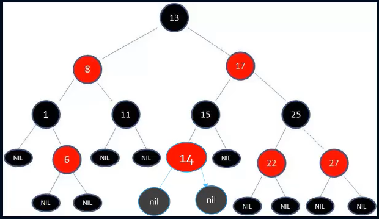

但如果默认颜色为黑色，则必然导致某些路径上多出了黑色节点。此时还要将其置为红色，才能保持 balance

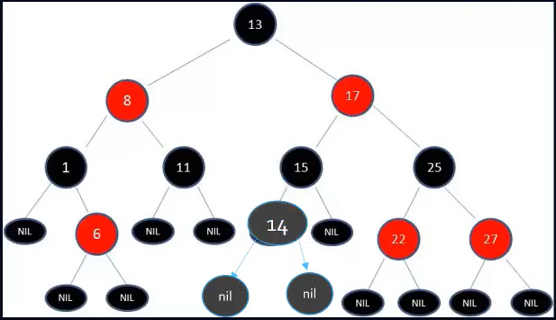

并且，如果默认颜色为黑色，可能只有通过调整其他节点，才能够实现树的 balance ，但调整其它节点后，可能会让树结构更加不平衡。

例如，进行某些操作后，必须要让 `key` 为 `25` 的节点变为红色才可，但是`25`节点变色后，会让树结构更加不平衡。

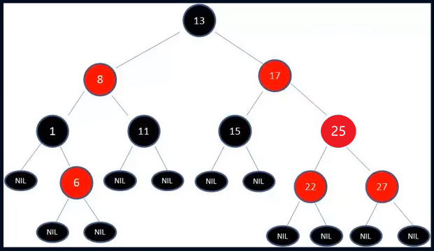

但是，默认颜色为红色，也可能会导致出现连续的红色节点（插入`21`），但这种情况比较好解决，可通过 `变色`、`旋转` 保持平衡。

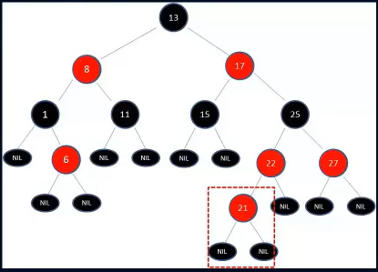

## 左旋转

* 以 `X` 为中心，将 `Y` 逆时针向上旋转九十度
* 再将 `Y` 的左子树，转化为 `X` 的右子树

经过左旋转后，得到的树依旧符合 BST 规则。

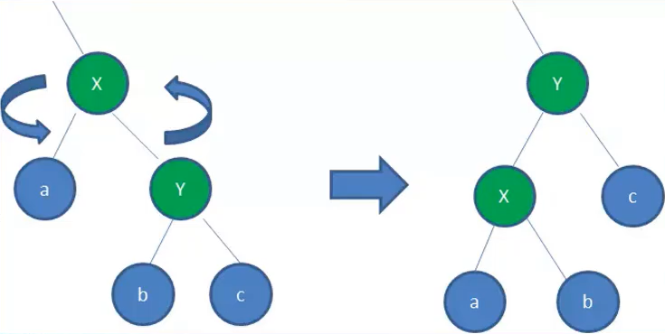

## 右旋转

* 以 `X` 为中心，将 `Y` 顺时针向上旋转九十度
* 再将 `Y` 的右子树，转化为 `X` 的左子树

经过右旋转后，得到的树依旧符合 BST 规则。

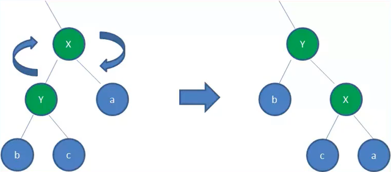

# 插入操作

总结插入操作，可以划分为五种情景，让我们详细了解不同情景下需要怎样操作，才能保持 BST 的平衡。

值得注意的是：

* 默认颜色为红（原因请翻阅[上文](###默认颜色)）
* 新节点插入的初始位置，总是在叶子节点处，为了满足 rule2 ，需要为新节点添加两个`NIL`子节点

下文在讲解时，都遵循以下约定：

* 即将插入的节点为 `N`（node）
* 其父节点为 `P`（parent）
* 其祖父节点为 `G`（grandfather）
* 其父节点的兄弟节点(也就是叔叔节点)为 `U`（uncle）

## 情景一、二

这两种情景是最简单的，不用进行复杂操作即可保持balance。

**情景一**

​	若为空树，则 `N` 要置为根节点，此时将其变为黑色（满足rule1）

**情景二**

​	插入 `N` 后，`P` 节点为黑色，则什么都不用做，依旧满足红黑树规则

* 符合rule3
* 符合rule4
  * 尽管新节点 `N` 有两个黑色的叶子节点(NIL)，但是 `N` 为红色，所有经过 `N` 到达叶子节点的路径依然都包含相同数目的黑色节点。（左右两条路都同时增加一个黑色节点）

## 情景三

`P`、`U` 节点都为红色。

* 父叔红、祖父黑

（下图省略 NIL 节点）

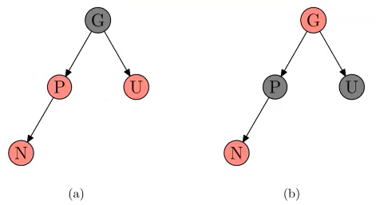

### 操作方案

将其转化为：父叔黑、祖父红

* `P` 和 `U` 变为黑色，并将 `G` 变换为红色。

### 解析

`P` 变黑 ：为了满足 rule3

`U` 变黑 ：为了满足 rule4

`G` 变红：为了后期不断递归变换。

**可能出现的问题：**

* 若 `G` 的父节点依旧为红色，这就违反了 rule3，但我们可以向上递归调整颜色
* 但是如果递归到了根节点，则就要进行旋转了

## 情景四

`U` 节点为黑色，`P` 节点为红色，`N` 是 `P` 的左孩子。

* 父红叔黑、祖父黑，插入节点是左孩子

（下图省略 NIL 节点）

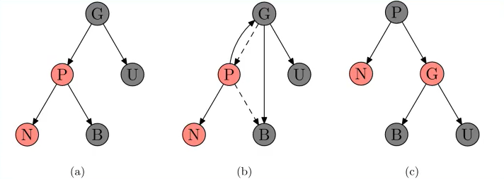

### 操作方案

1. 将其转化为：父叔黑、祖父红
   * `P` 变为黑色，并将 `G` 变换为红色。
2. 对 `G` 进行右旋转

## 情景五

`U` 节点为黑色，`P` 节点为红色，`N` 是 `P` 的右孩子。

* 父红叔黑、祖父黑，插入节点是右孩子

（下图省略 NIL 节点）

### 操作方案

1. 对 `P` 进行左旋转，形成 [情景四](##情景四)
2. 按照 [情景四](##情景四) 方案进行解决
   * N 与 G 变色 ，对 G 进行右旋转

## 实例体验

上文讲解了 RBT 插入新节点时对应的五种情景，我们通过实际的案例进行体验，看看经过上述变换后是否能够维持 BST 的 balance 。

​	依次插入 `key` 为：10、9、8、7、6、5、4、3、2、1 的节点，此时为极端状况，如果不做处理就会导致 BST 退化为链表。

**插入10**

符合情景1，插入后进行变色即可。

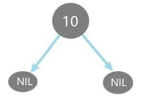

**插入9**

符合情景2，不做任何操作即可满足所有 rule 

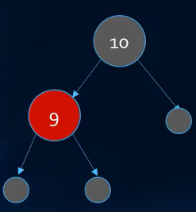

**插入8**

符合情景4：

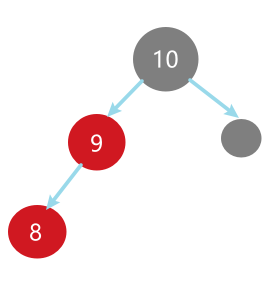

`P` 变黑，`G` 变红 ，对 `G` 右旋转：

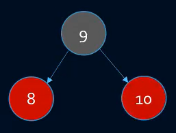

**插入7**

符合情景3：

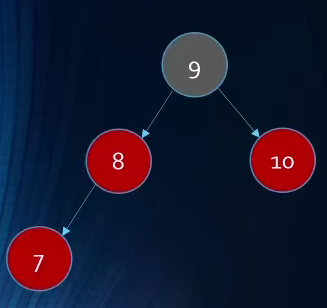

`P`和`U`变黑，`G` 变红：

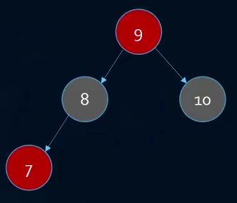

但此时问题出现了，因为 `9` 为根节点，所以必须为黑色，因此 `9` 在这里不用变为红色。

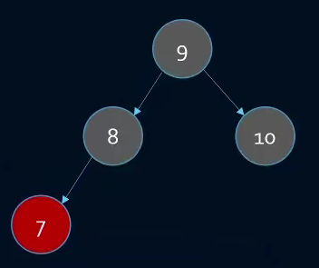

**插入6**

对于 6、7、8 三个节点来说，符合情景4：`P` 变黑，`G` 变红 ，对 `G` 右旋转：

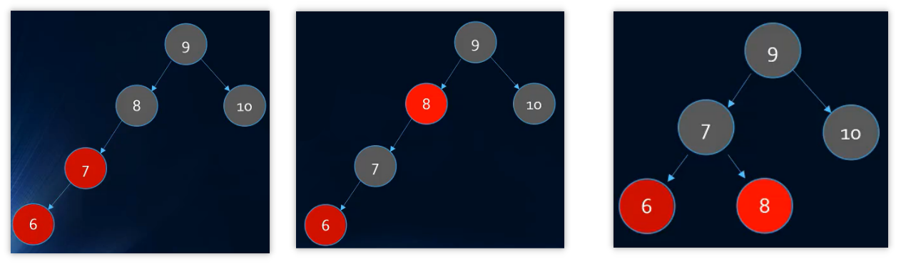

**插入5**

符合情景3：`P`和`U`变黑，`G` 变红：

**插入4**

符合情景4：`P`变黑，`G` 变红，对 `G` 右旋

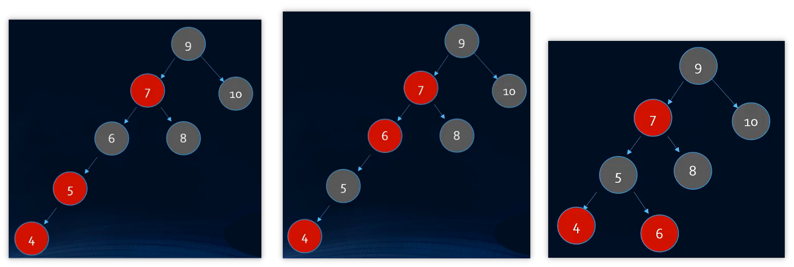

​	疑问： 这里其实可以发现 RBT 好像并不平衡，并且细心者可以察觉到，可以将 5、7、9 当作情景4来操作，就能将该树转为满二叉树，即便此时5、7、9不严格符合情景4（`N` 为黑色）。

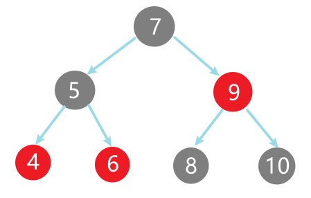

> 但其实不用心急，因为在后续插入节点时，会遇到相应的情况，最终会向上递归进行转化。因此这里不用将 5、7、9 进行转化。

**插入3**

符合情景3：将 `P`、`U` 变为黑色，`G` 变为红色。

* 但此时会出现连续的红色节点，所以递归向上将 5、7、9 进行转化（这也就是上文不用将 5、7、9 转化的原因）

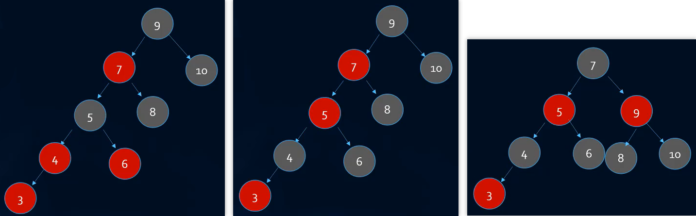

**插入2**

符合情景4：`P`变黑，`G` 变红，对 `G` 右旋

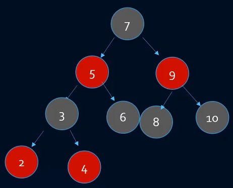

**插入1**

* 1、2、3 符合情景3，进行变色即可
* 3、5 出现连续红色节点
* 3、5、7符合情景3，再进行变色
* 7 为根节点，将其变为黑色

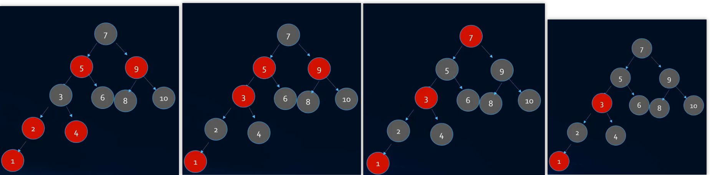

