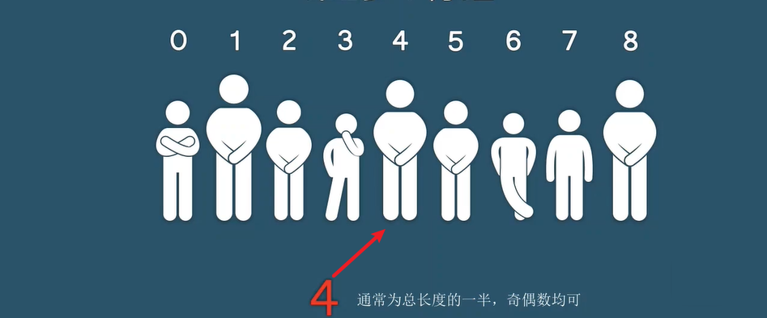
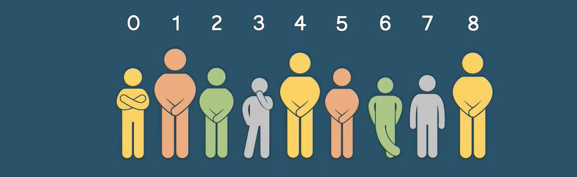

## 大致思路

​	先把整个数组按照某个数值 `h` 进行分组，然后让每个组内都进行排序，这样整个数组看起来就 `稍微整齐了一些`。然后每轮排序完毕后，都将 `h` 缩小为原来的一半，从而提高分组的精度，再次进行排序，这样目标数组就会变得 `更加有序`。直到 `h` 缩小为 `1` ，整个数组为一个大组，再次进行排序，数组完全有序。

​	利用了分组的思想，先将各个小组内部变得有序，从而使得整体 `趋于整齐`，再将分组的精度提高，从而逐步趋于 `完全整齐`。

​	上文所提到的组内排序，利用的是 `插入排序`，因为 **局部有序，插入排序最优**

>**局部有序，插入排序最优**
>
>​	因为插入排序的思想就是无序部分向有序部分逐步插入。比如按从小到大规则进行排序，无序部分的元素只需要依次按照自右向左的顺序向有序部分进行比较，如果无序元素大于当前有序元素，则直接插入，否则交换。
>
>​	希尔排序，实际上就是插入排序的升级版本，利用分组思想减少元素的对比、交换过程，从而提高效率

​	上面所提到的分组精度 `h`  (一般定为 `Math.floor(array.length/2)`)；最小值为 `1` ，`h` 等于 `1` 时，整个数组划分为一个大组，此时再进行一轮排序，该轮排序就是最简单的插入排序

## 过程讲解

为了更好的理解，下文将把希尔排序的过程抽象为按身高排队的实际场景。

*1.初始混乱状态*

​	总共为 8 个人，初始化 `h` 为 `4` 

​	按照 h 依次分组：`0、4、8` 、 `1、5`、`2、6`、`3、7` 各为一组

​	各组内进行排序，排序完毕后，整体趋于有序

​	`h` 缩减为 `2`，`1、3、5、7`、`2、4、6、8` 各为一组。再次排序，整体更加趋于有序

​	`h` 缩减为 `1`，整体为一大组，再次排序，此时整体完全有序

