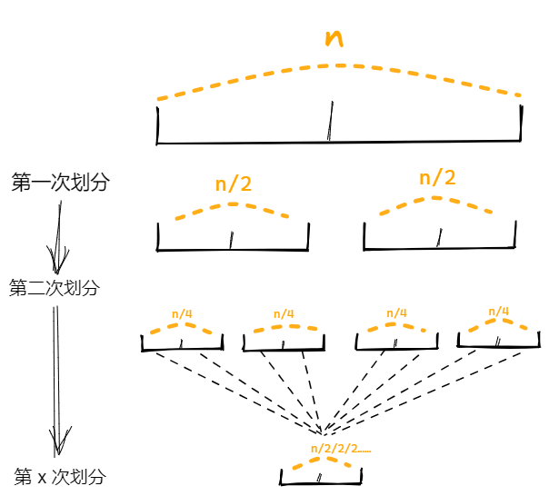
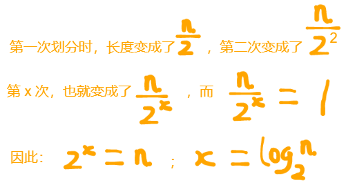
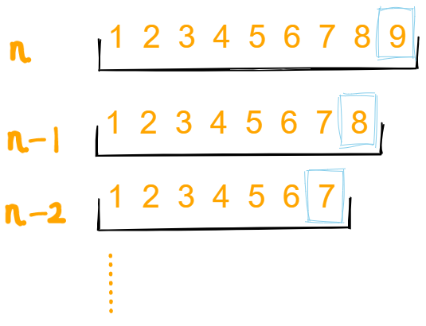

快速排序，其核心思想为：寻找一个`基点`，该基点将数据划分为左右两部分，比基点小的放在左侧，反之放在右侧。然后左右两部分又分别看成一个独立的数据块，再次进行上述操作，不断递归，直至划分为最小长度为2时，完成排序，整个数组也就有序了。

## 方案一

**代码部分**

```
function sort(arr, callback) {
	let base = 0;			//基点索引
  let leftArr = [];
  let rightArr = [];
  //以基点，将数据划分为左右两个部分
  for (let i = 1; i < arr.length; i++) {
    callback(arr[base], arr[i]) > 0
      ? leftArr.push(arr[i])
      : rightArr.push(arr[i]);
  }
  //在分别对左右两部分不断执行上述操作
  leftArr.length >= 2 && (leftArr = sort(leftArr, callback));
  rightArr.length >= 2 && (rightArr = sort(rightArr, callback));
  //返回本次排序好的数据块
  return [...leftArr, arr[base], ...rightArr];
}
```

**测试**

```
let arr = [9, 2, 5, 7, 6, 8, 1, 3, 4];
console.log(sort(arr, (a, b) => a - b));
```

>该方案虽然编写过程更加简便，思路更加简洁，但是性能却不理想，在 leetcode 例题([912. 排序数组](https://leetcode-cn.com/problems/sort-an-array/))中，不能通过最后的测试用例，会导致栈溢出。
>可以使用 **方案二** ，是标准的快排代码。

## 方案二

* 约定 `基点` 是当前数组的最后一个元素。
* 封装 `sort` 函数，传入需要排序的数组范围，不断递归，完成排序

基本步骤：

* `left` 所指向的元素，若 `<=` base，代表符合条件，`left`向后移动。
* 同理，`right` 所指向的元素，若 `>=` base，代表符合条件，`right`向前移动。
* `left` 与 `right` 标记的范围不断收缩，直到 `left > right` ，此时 `left` 指向的位置，就是 base 的正确位置，让 `left` 与 `base` 元素进行交换。
* 此时满足： base 左侧元素都`<=base`，右侧元素都 `>=base`。

```
//标准快排
function quickSort(nums) {
  sort(nums, 0, nums.length - 1);
  return nums;

  function sort(nums, start, end) {
    if (start >= end) return;

    let l = start;
    let base = nums[end];
    let r = end - 1;

    while (l <= r) {
      while (l <= r && nums[l] <= base) l++;
      while (l <= r && nums[r] >= base) r--;
      if (l <= r) exchange(nums, l, r);
    }

    exchange(nums, end, l);

    sort(nums, start, l - 1);
    sort(nums, l + 1, end);
  }

  function exchange(nums, i, j) {
    let temp = nums[i];
    nums[i] = nums[j];
    nums[j] = temp;
  }
}
```

## 复杂度分析

### 时间复杂度

我们再来回顾一下快速排序的思想流程：

* 寻找一个基点，利用该基点将数组一分为二，将小于该基点的数字放在左侧，反之放在右侧。
* 然后对划分后的左右两部分继续以同样的形式排序，也就是不断地递归操作，直到 `start>=end` 时结束（当 start == end 时，只有一个元素，也就不用排序了）

*递归操作*

​	递归过程，实际上就是不断将当前 Array 一分为二，并完成排序，一直划分到当前 Array 只有一个元素时停止。

最后将划分 **log<sub>2</sub><sup>n</sup>** 次，详见图解：






*每次的排序操作*

​	每次划分数组的过程，也是排序的过程，将小于该基点的数字放在左侧，反之放在右侧。因此要通过指针的移动进行遍历，数组长度为 n ，就要执行 n 次。因此最终的时间复杂度是 n * log<sub>2</sub><sup>n</sup> 

#### 最好状况

​	最好的情况：每次选取的 base 正好能够被替换到当前数组的 **中间位置**，实现完全均分数组，因此能够完全符合上述的公式推断，此时的时间复杂度为：n * log<sub>2</sub><sup>n</sup> 

​	上文的公式推断，实际上描述的是通常状态，可能 base 不能被正常的替换到 **中间位置**，但也需要不断的递归，划分、排序。因此也是 n * log<sub>2</sub><sup>n</sup> 。

#### 最坏状况

​	最坏状况：每次选取的 base ，刚刚可以被插入到 Array 的 **最左端** 或 **最右端**，因而不能实现将 Array 一分为二。

* 每次刚好可以插入最左端：当前数组一直满足降序有序
* 每次刚好可以插入最左端：当前数组一直满足升序有序

下图示例一直满足升序有序：



由于不能将 Array 一分为二，每次都将其它元素，放置在 base 的最左侧，例如当前数组长度为 x ，将执行 x 次，因此得到等差数列之和：`n*(n-1)*(n-2)*……1` == `(n+1)*n / 2` == O(n<sup>2</sup>)

### 空间复杂度

​	每次递归都将产生一些临时的变量（指针等），将递归 log<sub>2</sub><sup>n</sup> 次，因此空间复杂度是 O(log<sub>2</sub><sup>n</sup>)
