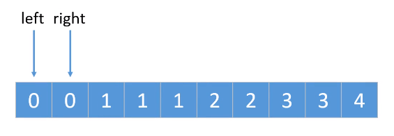
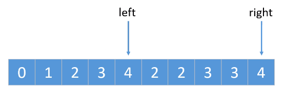

## 题目

[原题](https://leetcode-cn.com/leetbook/read/top-interview-questions-easy/x2gy9m/)

* 给你一个有序数组 nums ，请你 **原地** 删除重复出现的元素，使每个元素 **只出现一次** ，返回删除后数组的新长度。
* 不要使用额外的数组空间，你必须在 **原地** **修改输入数组** 并在使用 O(1) 额外空间的条件下完成。

示例 1：

```
输入：nums = [1,1,2]
输出：2, nums = [1,2]
解释：函数应该返回新的长度 2 ，并且原数组 nums 的前两个元素被修改为 1, 2 。不需要考虑数组中超出新长度后面的元素。
```

示例 2：

```
输入：nums = [0,0,1,1,1,2,2,3,3,4]
输出：5, nums = [0,1,2,3,4]
解释：函数应该返回新的长度 5 ， 并且原数组 nums 的前五个元素被修改为 0, 1, 2, 3, 4 。不需要考虑数组中超出新长度后面的元素。
```

## 题目分析

我们先简单分析一下题目中的重要讯息，目的是排序数组去重：

* 数组已经排序
* 重复项是连续的
* 要原地删除重复项，即操作原Array
* 不可以使用新的数组空间，且使用的额外空间满足O(1)

## 代码实现

​	一提到数组去重，你可能会想到该方法：`while(nums.length)`，然后不断弹出数据，如果新数组中不存在该 item ，就 ` push` 进入新数组。可是这并不符合上述要求(使用了新的数组空间)。

### 解决思路



* 使用两个指针：`left`、`right`。
* right 不断向后移动，检测后面数据是否与 left 所指向的数据相同：
* 如果相同，则 right 继续向后移动
* 如果不同，则让 left 先向后移动，再把 right 所指向的数据赋值给 left 位置。
* 不断持续上面几步，直到 right 移至到末尾。

最后我们就可以得到：



从下标 `0~left` ，为去重后的 Array 。

### 代码

​	下面两种代码思路是一样的，只不过一个使用 `while `、一个使用 `for` 。使用上述思路进行实现，`for`循环代码更加简洁。

代码一：

```
export default function removeDuplication(nums) {
  let left = 0;
  let right = 1;

  while (right < nums.length) {
    if (nums[left] === nums[right]) {
      right++;
    } else {
      nums[++left] = nums[right];
    }
  }
  nums.length = left + 1;
  return nums.length;
}
```

代码二：

```
export default function removeDuplication(nums) {
  let left = 0;
  for (let right = 1; right < nums.length; right++) {
    if (nums[left] !== nums[right]) nums[++left] = nums[right];
  }
  nums.length = left + 1;
  return nums.length;
}
```

