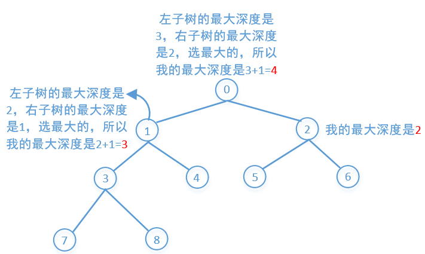

## 题目

[原题](https://leetcode-cn.com/leetbook/read/top-interview-questions-easy/xnd69e/)

* 给定一个二叉树，找出其最大深度。
  * 二叉树的深度为：根节点到最远叶子节点的最长路径上的节点数。


示例：

* 给定二叉树 [3,9,20,null,null,15,7]，

    			 3
          	  / \
          	 9  20
          	   /  \
          	  15   7

返回它的最大深度 3 。

## 代码实现

### 方案一

层序遍历，记录层数

```
export default function maxDepth(root) {
  if (!root) return 0;

  const queue = [[root, 0]];
  const result = [];

  while (queue.length) {
    const [node, level] = queue.shift();
    if (!result[level]) {
      result[level] = true;
    }
    node.left && queue.push([node.left, level + 1]);
    node.right && queue.push([node.right, level + 1]);
  }

  return result.length;
}
```

### 方案二

递归，不断求某节点左右子树的最长路径。



```
export default function maxDepth(root) {
  return root ? Math.max(maxDepth(root.left), maxDepth(root.right)) + 1 : 0;
}
```

