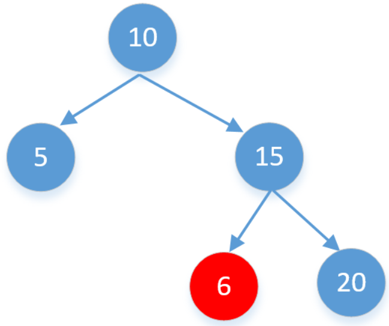

## 题目

[原题](https://leetcode-cn.com/leetbook/read/top-interview-questions-easy/xn08xg/)

给你一个二叉树的根节点 `root` ，判断其是否是一个有效的二叉搜索树。

有效 二叉搜索树定义如下：

* 节点的左子树只包含 小于 当前节点的数。
* 节点的右子树只包含 大于 当前节点的数。
* 所有左子树和右子树自身必须也是二叉搜索树。


示例 1：


```
输入：root = [2,1,3]
输出：true
```

示例 2：


```
输入：root = [5,1,4,null,null,3,6]
输出：false
解释：根节点的值是 5 ，但是右子节点的值是 4 。
```

**提示：**

- 树中节点数目范围在[1, 10<sup>4</sup>] 内
- -2<sup>31</sup> <= Node.val <= 2<sup>31</sup> - 1

## 代码实现

### 方案一

* 递归判断当前节点的左右子节点是否符合条件
* **注意判断节点的取值区间**

#### 错误代码

虽然看上去没什么问题，但不能够通过所有测试用例。

* 因为在递归过程中，只是父子节点相互比较，并没有考虑当前节点是否破坏了祖先节点的结构规则。

例如下图：



```
export default function isValidBST(root) {
  if (!root) return true;

  if (
    (root.left && root.key <= root.left.key) ||
    (root.right && root.key >= root.right.key)
  )
    return false;

  return isValidBST(root.left) && isValidBST(root.right);
}
```

#### 解决错误

因此，我们要为当前节点设置上下限，只有当`node`值在指定区间内，才符合要求。

```
export default function isValidBST(root) {
  return deep(root, Infinity, -Infinity);

  function deep(root, max, min) {
    if (!root) return true;
    if (root.key <= min || root.key >= max) return false;

    return deep(root.left, root.key, min) && deep(root.right, max, root.key);
  }
}
```

### 方案二

中序遍历解决：`BST`中序遍历得到结果为有序，

* 只要判断结果是否有序即可

```
export default function isValidBST(root) {
  let arr = [];
  midDeep(root);

  function midDeep(root) {
    root.left && midDeep(root.left);
    arr.push(root.key);
    root.right && midDeep(root.right);
  }

  for (let i = 0; i < arr.length - 1; i++) {
    if (arr[i] >= arr[i + 1]) return false;
  }

  return true;
}
```

