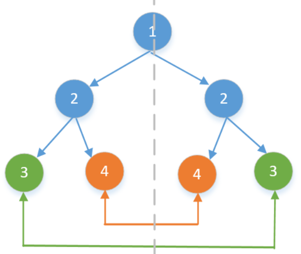

## 题目

[原题](https://leetcode-cn.com/leetbook/read/top-interview-questions-easy/xn7ihv/)

给定一个二叉树，检查它是否是镜像对称的。

 

例如，二叉树 [1,2,2,3,4,4,3] 是对称的。

    		1
       / \
      2   2
     / \ / \
    3  4 4  3


但是下面这个 [1,2,2,null,3,null,3] 则不是镜像对称的:

        1
       / \
      2   2
       \   \
       3    3

进阶：

你可以运用递归和迭代两种方法解决这个问题吗？

## 代码实现

### 方案一

* 层序遍历,判断每一层是否对称
* 注意对节点为 `null` 的处理

```
function isSymmetric(root) {
  let queue = [[root, 0]];
  let arr = [];

  while (queue.length) {
    const [node, level] = queue.pop();
    let val = node ? node.val : "null";
    if (arr[level]) {
      arr[level].push(val);
    } else {
      arr[level] = [val];
    }
    if (val === "null") continue;

    queue.unshift([node.left, level + 1]);
    queue.unshift([node.right, level + 1]);
  }

  for (let level = 0; level < arr.length; level++) {
    const currentLength = arr[level].length;
    for (let j = 0; j < currentLength / 2; j++) {
      if (arr[level][j] !== arr[level][currentLength - j - 1]) return false;
    }
  }

  return true;
}
```

### 方案二

递归思想，非递归代码

每次判断`currentNode`的左右子节点是否对称

* 没有左右子节点（对称）
* 只存在一个子节点（不对称）
* 存在两个子节点，但二者值不同（不对称）

**然后递归判断**：

* `left.left` 与 `right.right`
* `left.right` 与 `right.left`



```
function isSymmetric(root) {
  if (!root) return true;

  let queue = [[root.left, root.right]];
  while (queue.length) {
    const [left, right] = queue.pop();
    if (!left && !right) continue;
    if (!left || !right || left.val !== right.val) return false;
    queue.unshift([left.left, right.right]);
    queue.unshift([left.right, right.left]);
  }

  return true;
}
```

