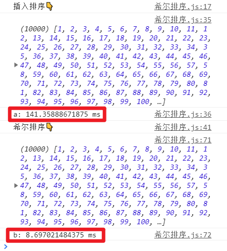

在插入排序中，`第二层for循环`维护的是`已排序部分`，让未排序部分的第一个元素与已排序中的元素对比，一旦符合要求就进行数据的交换，交换次数很频繁。

希尔排序，是升级版的插入排序，相对于插入排序，减少了数据交换的次数。

## 排序的原理

​	之所以能达到减少交换次数的效果，是因为对数据进行了分组，且只对每组的首尾元素进行判断（首元素代表已排序部分，尾元素代表未排序部分），符合要求就交换位置。并且每经过一趟排序，增量h都要缩减为原来的一半，来不断提高排序的精度。直至h==1。

1. 选定一个增长量h，作为数据分组的依据。
2. 对按h分好的每一组数据完成插入排序。
3. 减小增长量h(最小为1)，重复第二步操作

## 伪代码

```
初始化h;

//在h变为1之前，不断进行排序
while (h >= 1) {
  //找到待插入元素
  for (let i = h; i < arr.length; i++) {
    //把待插入元素，插入到有序部分,对所有的分组都执行该操作
    for (let j = i; j >= h; j -= h) {
      if (arr[j] > arr[j - h]) {
        change;
      } else {
        break;
      }
    }
  }
  //每排序一个分组，h/2
  h = h / 2;
}
```

## h变量的定义

### 初始化规则

1. 设置为`1`
2. 如果h小于数组长度的一半，就不断让其`h=h*2+1`

```
let h = 1;
while (h < arr.length / 2) {
  h = h * 2 + 1;
}
```

### 缩小规则

* 每次缩小为原来的一半，向下取整

```
//每经过一轮排序，都要让h/2
h = Math.floor(h / 2);
```

## 真正实现

**工具函数**

```
function change(arr, i, j) {
  let temp = arr[i];
  arr[i] = arr[j];
  arr[j] = temp;
}
```

```
function sort(arr, callback) {
  //初始化增量h
  let h = 1;
  while (h < arr.length / 2) {
    h = h * 2 + 1;
  }
  //希尔排序
  //在h变为1之前，不断进行排序
  while (h >= 1) {
    //找到待排序的元素
    for (let i = h; i < arr.length; i++) {
      //将待排序元素插入已排序部分,对所有的分组都执行该操作
      for (j = i; j >= h; j -= h) {
        if (callback(arr[j - h], arr[j]) > 0) {
          change(arr, j, j - h);
        } else {
          break;
        }
      }
    }
    //每经过一轮排序，都要让h/2
    h = Math.floor(h / 2);
    console.log(h);
  }
}
```

**测试**

```
let arr = [9, 1, 2, 5, 7, 4, 8, 6, 3, 5];
sort(arr, (a, b) => {
  return b - a;
});
console.log(arr);
```


## 测试执行效率

```
//工具函数
function change(arr, i, j) {
  let temp = arr[i];
  arr[i] = arr[j];
  arr[j] = temp;
}
function initArr() {
  let first = 10000;
  let arr = [];
  for (let i = first; i >= 1; i--) {
    arr.push(i);
  }
  return arr;
}
```

```
//插入排序测试
{
  console.log("插入排序👇");
  let arr = initArr();

  function sort(arr, callback) {
    for (let i = 1; i < arr.length; i++) {
      for (let j = i; j > 0; j--) {
        if (callback(arr[j - 1], arr[j]) > 0) {
          change(arr, j, j - 1);
        } else {
          break;
        }
      }
    }
  }
  console.time("a");
  sort(arr, (a, b) => {
    return a - b;
  });
  console.log(arr);
  console.timeEnd("a");
}
```

```
//希尔排序测试
{
  console.log("希尔排序👇");
  let arr = initArr();
  function sort(arr, callback) {
    //初始化增量h
    let h = 1;
    while (h < arr.length / 2) {
      h = h * 2 + 1;
    }
    //希尔排序
    while (h >= 1) {
      for (let i = h; i < arr.length; i++) {
        for (j = i; j >= h; j -= h) {
          if (callback(arr[j - h], arr[j]) > 0) {
            change(arr, j, j - h);
          } else {
            break;
          }
        }
      }
      //每经过一轮排序，都要让h/2
      h = Math.floor(h / 2);
    }
  }
  console.time("b");
  sort(arr, (a, b) => {
    return a - b;
  });
  console.log(arr);
  console.timeEnd("b");
}
```

**结果**



